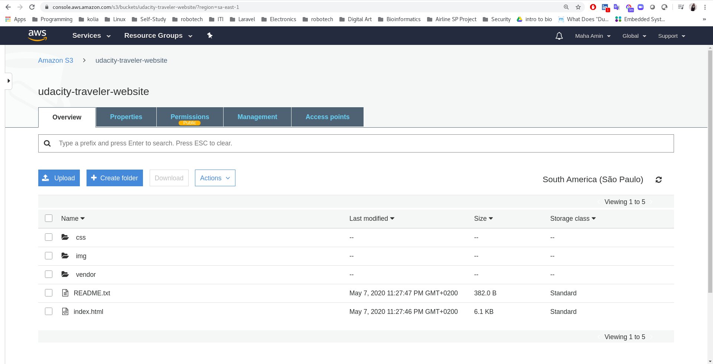
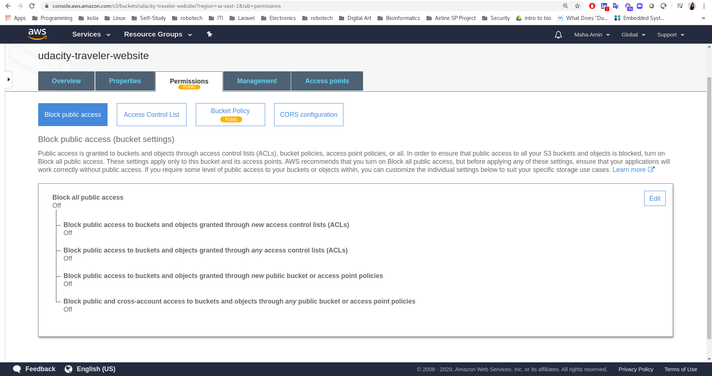
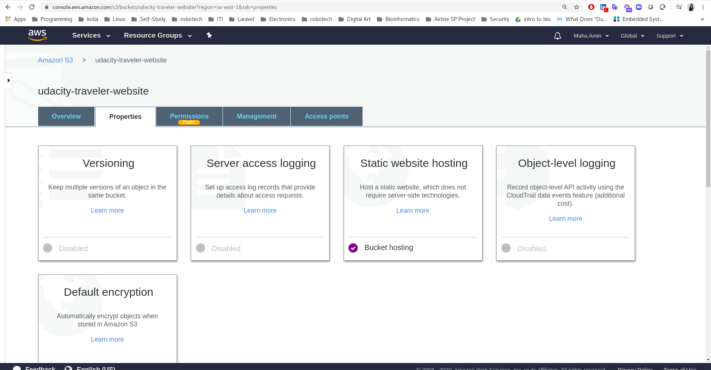
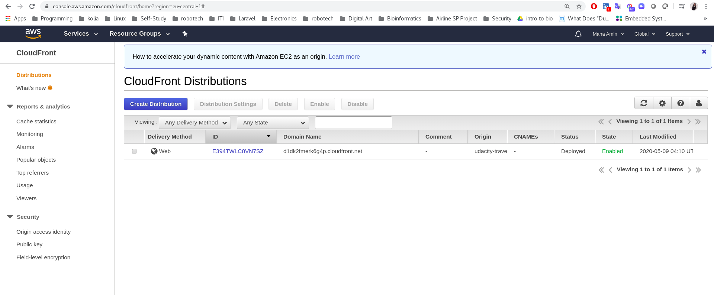

# Deploy Static Website on AWS

**Author:** Maha Amin Abdelfattah  
**Udacity DevOps Engineer Nanodegree**

## CloudFront Endpoint:
http://d1dk2fmerk6g4p.cloudfront.net/index.html

## Steps:
- Create S3 Bucket on AWS and upload website files:

- Secure bucket via IAM:

- Configure S3 bucket to host static website:

- Create CloudFront distribution:

- Access website in web browser:

