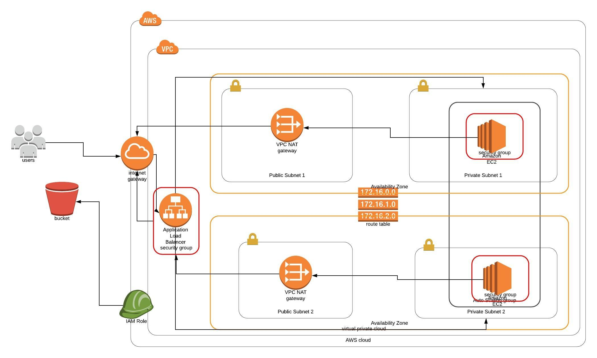

# Deploy A High Availability Web App Using CloudFormation

## Description:
This is the second project in Udacity-DevOps-Engineer Nanodegree. In this project, it is required to deploy infrastructure as code for a web app "Udagram" using CloudFormation on AWS.

## Infrastructure Diagram:
